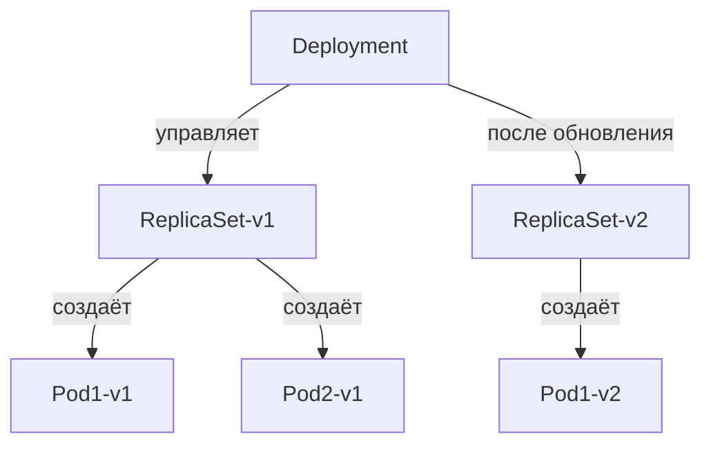
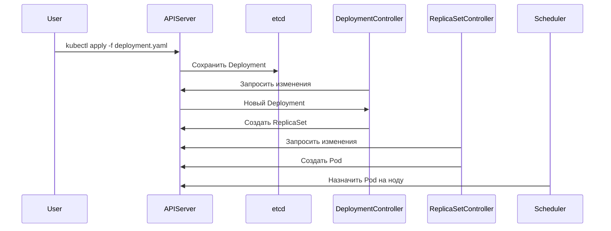

Да, **Deployment** в Kubernetes — это действительно **кастомный ресурс + контроллер**, который управляет подами (Pods) через **ReplicaSet**. Разберём его устройство "под капотом".

---

## **1. Deployment — это абстракция над ReplicaSet**
- **Deployment** не создаёт поды напрямую.  
- Он **генерирует ReplicaSet**, который уже управляет подами.  
- При обновлении Deployment создаёт **новый ReplicaSet** и постепенно заменяет старый (rolling update).  



---

## **2. Как работает контроллер Deployment?**
Контроллер Deployment — это часть **kube-controller-manager**. Его логика:

### **1. Отслеживание желаемого состояния**
- Вы описываете Deployment в YAML:
  ```yaml
  apiVersion: apps/v1
  kind: Deployment
  metadata:
    name: nginx
  spec:
    replicas: 3
    selector:
      matchLabels:
        app: nginx
    template:
      metadata:
        labels:
          app: nginx
      spec:
        containers:
        - name: nginx
          image: nginx:1.25
  ```
- Контроллер **сравнивает** `spec` с текущим состоянием.

### **2. Создание ReplicaSet**
- Deployment **не управляет подами напрямую** — он создаёт ReplicaSet, который уже создаёт поды.  
- ReplicaSet — это отдельный ресурс:
  ```sh
  kubectl get replicasets -l app=nginx
  ```

### **3. Rolling Update (постепенное обновление)**
1. При изменении `spec.template` (например, `image: nginx:1.25 → nginx:1.26`):  
   - Deployment **создаёт новый ReplicaSet**.  
   - Постепенно **увеличивает** количество подов в новом ReplicaSet.  
   - **Уменьшает** поды в старом ReplicaSet.  

2. Если что-то пошло не так — **откатывается** на предыдущую версию.

---

## **3. Разница между Deployment и ReplicaSet**
| **Функция**               | Deployment                          | ReplicaSet                     |
|---------------------------|-------------------------------------|--------------------------------|
| **Версионирование**       | Хранит историю ReplicaSet (для rollback) | Нет истории                   |
| **Обновление**            | Поддерживает rolling update         | Только recreate               |
| **Гибкость**              | Может управлять стратегиями обновления | Только репликация            |
| **Использование**         | Рекомендуется для stateless-сервисов | Обычно не используется напрямую |

---

## **4. Как Deployment взаимодействует с API Kubernetes?**
1. **Пользователь** создаёт/обновляет Deployment через `kubectl apply`.  
2. **API-сервер** сохраняет состояние в etcd.  
3. **Deployment-контроллер** (в `kube-controller-manager`):  
   - Замечает изменение в etcd.  
   - Создаёт/обновляет ReplicaSet.  
4. **ReplicaSet-контроллер** создаёт/удаляет поды.  
5. **Scheduler** назначает поды на ноды.  



---

## **5. Можно ли написать свой аналог Deployment?**
**Да!** Примерная логика:  
1. Создать **CRD** (например, `MyDeployment`).  
2. Написать **контроллер**, который:  
   - Будет следить за `MyDeployment`.  
   - Создавать **кастомные ReplicaSet** (или напрямую Pod’ы).  
   - Реализовать **стратегии обновления**.  

Пример на **Operator SDK**:  
```go
func (r *MyDeploymentReconciler) Reconcile(ctx context.Context, req ctrl.Request) (ctrl.Result, error) {
    myDeployment := &myv1.MyDeployment{}
    if err := r.Get(ctx, req.NamespacedName, myDeployment); err != nil {
        return ctrl.Result{}, client.IgnoreNotFound(err)
    }

    // 1. Создать Pod'ы (или свой аналог ReplicaSet)
    pods, err := r.buildPods(myDeployment)
    if err != nil {
        return ctrl.Result{}, err
    }

    // 2. Применить изменения
    if err := r.applyPods(ctx, myDeployment, pods); err != nil {
        return ctrl.Result{}, err
    }

    return ctrl.Result{}, nil
}
```

---

## **Вывод**
- **Deployment — это контроллер + кастомный ресурс**, который управляет ReplicaSet.  
- **ReplicaSet — низкоуровневый контроллер** для репликации подов.  
- **Можно создать свой аналог**, но Deployment уже покрывает 90% use-cases.  

Если нужно глубже разобрать конкретный механизм (например, rollback или стратегии обновления) — спрашивайте! 🚀