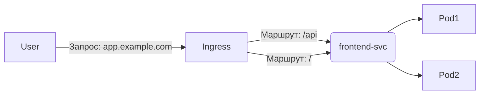

### **Ingress vs Service в Kubernetes: ключевые отличия и задачи**

---

## **1. Service: базовый доступ к приложению**
**Что делает?**  
Service — это абстракция, которая обеспечивает **стабильный доступ** к набору Pod'ов, даже если те пересоздаются (например, при обновлении или сбое).

### **Типы Service и их задачи:**
| Тип Service       | Задача                                                                 | Пример использования                     |
|-------------------|-----------------------------------------------------------------------|------------------------------------------|
| **ClusterIP**     | Доступ внутри кластера (по внутреннему IP/DNS)                        | Связь между микросервисами (`backend → db`) |
| **NodePort**      | Открывает фиксированный порт на всех нодах кластера (`30 000-32 767`) | Тестирование без Ingress                 |
| **LoadBalancer**  | Создает внешний IP (в облачных провайдерах: AWS, GCP)                 | Публичный доступ к веб-приложению        |

**Пример `service.yaml`:**
```yaml
apiVersion: v1
kind: Service
metadata:
  name: my-app-svc
spec:
  selector:
    app: my-app  # Связь с Pod'ами по label
  ports:
    - port: 80    # Порт Service
      targetPort: 8080  # Порт Pod'а
  type: ClusterIP
```

**Как работает?**  
- Service получает виртуальный IP (ClusterIP) или внешний IP (LoadBalancer).  
- Запросы на этот IP перенаправляются на случайный Pod из группы (с балансировкой).  

**Ограничения:**  
- Не умеет маршрутизировать HTTP/HTTPS трафик по доменам или путям.  
- Для публикации веб-сервисов требуется Ingress.

---

## **2. Ingress: продвинутая маршрутизация HTTP/HTTPS**
**Что делает?**  
Ingress — это **API-объект**, который управляет внешним доступом к сервисам через HTTP/HTTPS, предоставляя:  
- Маршрутизацию по доменам и URL-путям.  
- TLS-терминацию (HTTPS).  
- Load balancing.  

### **Компоненты Ingress:**
1. **Ingress Resource** (YAML-манифест):  
   - Правила маршрутизации (`host/path → Service`).  
2. **Ingress Controller** (программа):  
   - Обрабатывает правила Ingress (например, Nginx, Traefik, AWS ALB).  

**Пример `ingress.yaml`:**
```yaml
apiVersion: networking.k8s.io/v1
kind: Ingress
metadata:
  name: my-app-ingress
spec:
  rules:
  - host: app.example.com  # Маршрутизация по домену
    http:
      paths:
      - path: /api
        pathType: Prefix
        backend:
          service:
            name: api-svc  # Куда направлять трафик
            port:
              number: 80
      - path: /
        backend:
          service:
            name: frontend-svc
            port:
              number: 80
```

**Как работает?**  
1. Пользователь запрашивает `https://app.example.com/api`.  
2. Ingress Controller (например, Nginx) проверяет правила.  
3. Трафик перенаправляется в Service `api-svc`, который передает его в Pod'ы.  

---

## **3. Сравнение Service и Ingress**
| Характеристика          | Service                        | Ingress                          |
|-------------------------|-------------------------------|----------------------------------|
| **Уровень OSI**         | L4 (TCP/UDP)                  | L7 (HTTP/HTTPS)                  |
| **Балансировка**        | Round Robin (L4)              | Умная (L7, по путям/доменам)     |
| **Доступность**         | Внутри кластера или по IP     | По доменному имени               |
| **TLS**                 | Нет (только сквозное)         | Есть (терминация SSL)            |
| **Необходим контроллер**| Нет                          | Да (Nginx, Traefik, Istio)       |
| **Пример использования**| Доступ к БД, внутренним API   | Публичный веб-сайт, API-шлюз     |

---

## **4. Когда что использовать?**
### **Service:**
- Для **внутреннего общения** между микросервисами (`backend → db`).  
- Если нужно просто **пробросить TCP-порт** наружу (например, SSH).  

### **Ingress:**
- Для **публичных веб-приложений** (домены, HTTPS).  
- Если нужна **маршрутизация по URL-путям** (`/api → api-svc`, `/ → frontend-svc`).  
- Для **каннибализации портов** (1 внешний IP для множества сервисов).  

---

## **5. Как они работают вместе?**
**Типичный сценарий для веб-приложения:**  
1. **Deployment** создает Pod'ы с приложением.  
2. **Service** (`ClusterIP`) дает стабильный внутренний доступ к Pod'ам.  
3. **Ingress** направляет внешний HTTP-трафик в Service.  



---

## **6. Пример: развертывание веб-приложения**
### **Шаг 1: Создаем Deployment и Service**
```yaml
# deployment.yaml
apiVersion: apps/v1
kind: Deployment
metadata:
  name: frontend
spec:
  replicas: 3
  template:
    spec:
      containers:
      - name: nginx
        image: nginx
        ports:
        - containerPort: 80

# service.yaml
apiVersion: v1
kind: Service
metadata:
  name: frontend-svc
spec:
  selector:
    app: frontend
  ports:
    - port: 80
      targetPort: 80
  type: ClusterIP
```

### **Шаг 2: Настраиваем Ingress**
```yaml
# ingress.yaml
apiVersion: networking.k8s.io/v1
kind: Ingress
metadata:
  name: my-ingress
spec:
  rules:
  - host: myapp.com
    http:
      paths:
      - path: /
        pathType: Prefix
        backend:
          service:
            name: frontend-svc
            port:
              number: 80
```

### **Шаг 3: Устанавливаем Ingress Controller**
```bash
helm install ingress-nginx ingress-nginx/ingress-nginx
```

---

## **7. Частые проблемы**
| Проблема                          | Решение                              |
|-----------------------------------|--------------------------------------|
| Ingress возвращает 404            | Проверить `host` и `path` в правилах |
| Service не видит Pod'ы            | Убедиться, что `selector` совпадает с labels Pod'ов |
| HTTPS не работает                 | Добавить `tls` в Inress и секрет с сертификатом |

---

## **Вывод**
- **Service** — это «базовая сеть» Kubernetes для доступа к Pod'ам.  
- **Ingress** — «умный маршрутизатор» для HTTP/HTTPS трафика.  
- **Ingress не работает без Service** — он лишь направляет трафик в нужный Service.  

**Команды для проверки:**  
```bash
kubectl get svc,ingress  # Список Service и Ingress
kubectl describe ingress my-ingress  # Детали правил маршрутизации
curl -v http://myapp.com  # Тестирование доступа
```