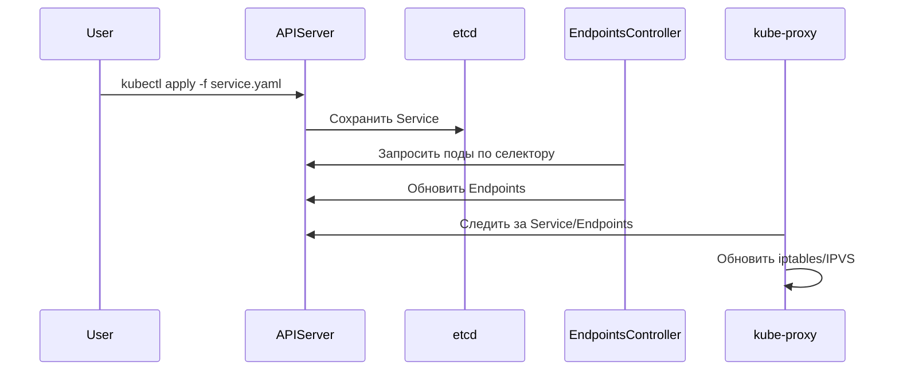

В Kubernetes **Service** — это абстракция, которая обеспечивает стабильный доступ к набору подов (Pods), даже если сами поды создаются/удаляются или меняют IP-адреса. Разберём его устройство "под капотом".

---

## **1. Типы Service и их назначение**
| Тип Service          | Описание                                                                 |
|----------------------|-------------------------------------------------------------------------|
| **ClusterIP**        | Виден только внутри кластера (внутренний балансировщик).                |
| **NodePort**         | Открывает порт на всех нодах кластера (`<NodeIP>:<StaticPort>`).        |
| **LoadBalancer**     | Создаёт внешний балансировщик (в облачных провайдерах: AWS, GCP).       |
| **Headless**         | Нет ClusterIP, возвращает IP подов напрямую (для StatefulSet, DNS).     |

---

## **2. Как Service работает внутри?**
### **1. Endpoints и EndpointSlices**
- **Service не управляет подами напрямую** — он использует **Endpoints** (или **EndpointSlices** в новых версиях Kubernetes).  
- **Endpoints** — это динамический список IP:порт подов, соответствующих селектору Service.  

Пример Endpoints:
```yaml
apiVersion: v1
kind: Endpoints
metadata:
  name: my-service  # Должно совпадать с именем Service!
subsets:
- addresses:
  - ip: 10.244.1.2  # IP пода
  - ip: 10.244.1.3
  ports:
  - port: 80
    protocol: TCP
```

### **2. kube-proxy: реализация сетевого доступа**
Компонент **kube-proxy** (работает на каждой ноде) отвечает за маршрутизацию трафика к Service.  

Он поддерживает 3 режима:
1. **Userspace (устарел)**  
   - Трафик идёт через проброс портов в пространстве пользователя.  
2. **iptables (по умолчанию)**  
   - Правила iptables перенаправляют трафик с ClusterIP на поды.  
   - **Минусы:** Нет балансировки "по умолчанию" (используется random).  
3. **IPVS (рекомендуется)**  
   - Использует ядерный модуль `ipvs` для балансировки (поддерживает алгоритмы: rr, wrr, lc и др.).  

Пример iptables-правила для Service:
```sh
# Просмотр правил
iptables -t nat -L KUBE-SERVICES | grep my-service
```

### **3. DNS-записи для Service**
- **ClusterIP Service** получает DNS-запись в формате:  
  `<service-name>.<namespace>.svc.cluster.local`.  
- **Headless Service** возвращает DNS-записи всех подов.  

Пример:
```sh
nslookup my-service.default.svc.cluster.local
```

---

## **3. Подробнее про ClusterIP**
1. **Создание Service:**
   ```yaml
   apiVersion: v1
   kind: Service
   metadata:
     name: my-service
   spec:
     selector:
       app: nginx
     ports:
       - protocol: TCP
         port: 80         # Порт Service
         targetPort: 8080 # Порт пода
     type: ClusterIP
   ```
2. **Что происходит внутри?**  
   - Service получает виртуальный IP (ClusterIP) из пуля `service-cluster-ip-range`.  
   - kube-proxy создаёт правила iptables/IPVS.  
   - Контроллер Endpoints заполняет список подов.  

---

## **4. Как устроен LoadBalancer?**
1. **Для облачных провайдеров (AWS, GCP):**  
   - Контроллер `cloud-controller-manager` создаёт внешний балансировщик.  
   - Обновляет статус Service:  
     ```yaml
     status:
       loadBalancer:
         ingress:
         - ip: 35.10.20.30
     ```
2. **В bare-metal:**  
   - Используются решения типа **MetalLB**.  

---

## **5. Headless Service (для StatefulSet)**
- Не имеет ClusterIP.  
- Возвращает IP подов напрямую через DNS.  

Пример:
```yaml
apiVersion: v1
kind: Service
metadata:
  name: my-headless
spec:
  clusterIP: None  # Важно!
  selector:
    app: db
  ports:
  - port: 5432
```

Запрос DNS вернёт:
```sh
dig my-headless.default.svc.cluster.local
# Ответ: 10.244.1.2, 10.244.1.3, ...
```

---

## **6. Как Service взаимодействует с API Kubernetes?**
1. **Пользователь** создаёт Service через `kubectl apply`.  
2. **API-сервер** сохраняет его в etcd.  
3. **Контроллер Endpoints** заполняет список подов.  
4. **kube-proxy** на каждой ноде обновляет правила iptables/IPVS.  



---

## **7. Можно ли создать свой аналог Service?**
**Да**, но это сложно. Примерная логика:  
1. Создать **CRD** (например, `MyService`).  
2. Написать **контроллер**, который:  
   - Будет следить за подами по селектору.  
   - Динамически обновлять список IP (аналог Endpoints).  
   - Управлять балансировщиком (например, через nginx или Envoy).  

---

## **Итог**
- **Service** — это абстракция над **Endpoints + kube-proxy**.  
- **ClusterIP** — виртуальный IP, балансировка через iptables/IPVS.  
- **LoadBalancer** — интеграция с облачными провайдерами.  
- **Headless** — для прямого доступа к StatefulSet.  

Если нужно глубже разобрать конкретный аспект (например, IPVS или ExternalName) — спрашивайте! 🚀