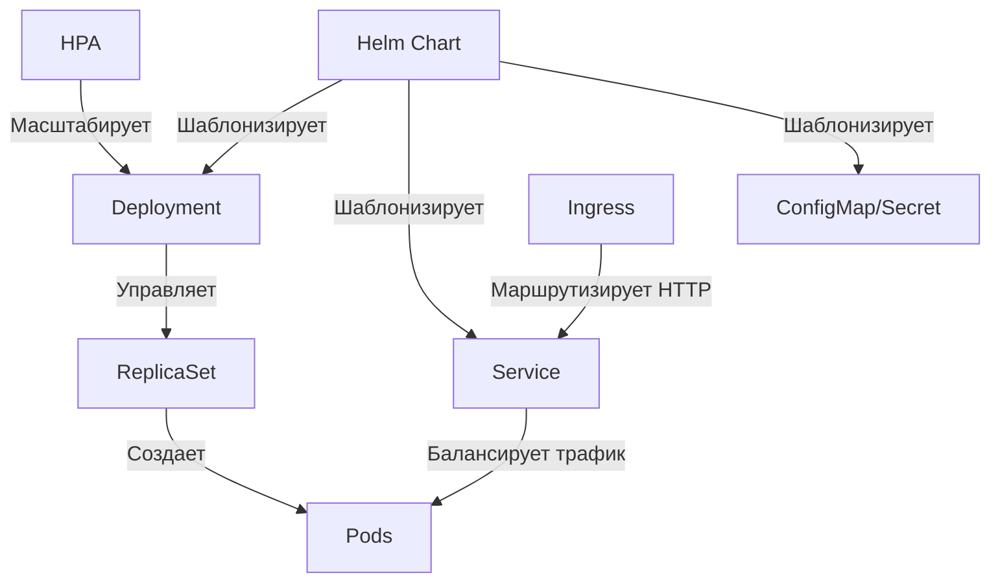
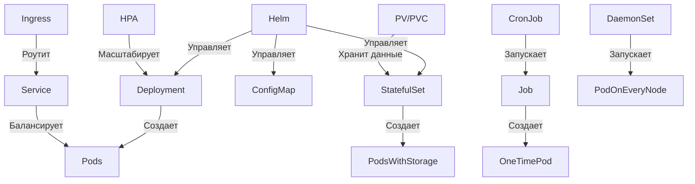

### **Иерархия и взаимодействие компонентов Kubernetes**  

В Kubernetes все компоненты работают **вместе**, но решают разные задачи. Они **не заменяют**, а **дополняют** друг друга.  

---

## **1. Общая схема взаимодействия**  



---

## **2. Роли компонентов**  

### **A. Deployment**  
- **Что делает:**  
  - Управляет **жизненным циклом** приложения (развертывание, обновление, откат).  
  - Контролирует **ReplicaSet**, который создает/удаляет поды.  
- **Пример:**  
  ```yaml
  apiVersion: apps/v1
  kind: Deployment
  metadata:
    name: nginx
  spec:
    replicas: 3
    template:
      spec:
        containers:
        - name: nginx
          image: nginx:1.25
  ```

### **B. Service**  
- **Что делает:**  
  - Обеспечивает **стабильный доступ** к подам (даже если их IP меняются).  
  - Балансирует нагрузку между подами.  
- **Пример:**  
  ```yaml
  apiVersion: v1
  kind: Service
  metadata:
    name: nginx-service
  spec:
    selector:
      app: nginx
    ports:
      - port: 80
  ```

### **C. Helm Chart**  
- **Что делает:**  
  - **Шаблонизирует** манифесты (Deployment, Service и др.) в единый пакет.  
  - Позволяет настраивать параметры через `values.yaml`.  
- **Пример структуры:**  
  ```
  my-chart/
  ├── Chart.yaml
  ├── values.yaml
  └── templates/
      ├── deployment.yaml
      ├── service.yaml
      └── hpa.yaml
  ```

### **D. HPA (Horizontal Pod Autoscaler)**  
- **Что делает:**  
  - **Автоматически масштабирует** количество подов на основе нагрузки (CPU/RAM).  
- **Пример:**  
  ```yaml
  apiVersion: autoscaling/v2
  kind: HorizontalPodAutoscaler
  spec:
    scaleTargetRef:
      apiVersion: apps/v1
      kind: Deployment
      name: nginx
    minReplicas: 1
    maxReplicas: 10
  ```

### **E. Ingress**  
- **Что делает:**  
  - Управляет **внешним HTTP(S)-доступом** к сервисам (роутинг, TLS).  
- **Пример:**  
  ```yaml
  apiVersion: networking.k8s.io/v1
  kind: Ingress
  metadata:
    name: nginx-ingress
  spec:
    rules:
    - host: example.com
      http:
        paths:
        - path: /
          backend:
            service:
              name: nginx-service
              port:
                number: 80
  ```

---

## **3. Как компоненты связаны?**  

| Компонент       | Зависит от                  | Для чего используется                  |  
|-----------------|-----------------------------|----------------------------------------|  
| **Deployment**  | Pods, ReplicaSet            | Развертывание и обновление приложения. |  
| **Service**     | Pods (через labels)         | Доступ к приложению внутри/снаружи.    |  
| **Helm**        | Deployment, Service, etc.   | Упаковка и управление конфигурацией.   |  
| **HPA**         | Deployment                  | Автомасштабирование.                   |  
| **Ingress**     | Service                     | Маршрутизация HTTP-трафика.            |  

---

## **4. Пример полного workflow**  

### **Шаг 1: Развертывание через Helm**  
```bash
helm install my-app ./my-chart -f values.yaml
```  
**Что происходит:**  
1. Helm применяет манифесты из `templates/` (Deployment, Service, HPA).  
2. Deployment создает ReplicaSet и поды.  
3. Service открывает доступ к подам.  

### **Шаг 2: Доступ к приложению**  
- **Внутри кластера:** Другие сервисы обращаются к `my-app-service:80`.  
- **Снаружи:** Ingress направляет трафик с `example.com` на `my-app-service`.  

### **Шаг 3: Масштабирование**  
- При высокой нагрузке **HPA** увеличивает `replicas` в Deployment.  

---

## **5. Ключевые выводы**  
1. **Deployment** — база для управления приложением.  
2. **Service** — обеспечивает сетевой доступ.  
3. **Helm** — упрощает управление конфигурацией (но не обязателен).  
4. **HPA/Ingress** — расширяют функциональность (автоскейлинг, роутинг).  

**Они не заменяют, а дополняют друг друга!**  

---

## **6. Когда что использовать?**  
| Сценарий                     | Компоненты                          |  
|------------------------------|-------------------------------------|  
| Развертывание приложения      | Deployment + Service                |  
| Управление конфигурацией      | Helm                                |  
| Автомасштабирование          | HPA + Deployment                    |  
| Публикация HTTP-сервисов     | Ingress + Service                   |  
| Stateful-приложения (БД)     | StatefulSet + Headless Service      |  

---

## **7. FAQ**  
**Вопрос:** Можно ли обойтись без Helm?  
**Ответ:** Да, но тогда все манифесты нужно применять вручную (`kubectl apply -f ...`).  

**Вопрос:** Зачем Ingress, если есть LoadBalancer?  
**Ответ:** Ingress дает гибкость (роутинг по доменам, TLS), а LoadBalancer — просто IP.  

**Вопрос:** Может ли Deployment работать без Service?  
**Ответ:** Да, но другие сервисы не смогут найти ваши поды стабильно.  

--- 

### **Что ещё входит в иерархию Kubernetes?**  

Помимо **Deployment**, **Service**, **Helm** и **HPA**, в Kubernetes есть ещё несколько ключевых компонентов, которые дополняют общую картину. Они решают специфические задачи и могут быть критически важны в зависимости от сценария.  

---

## **1. Дополнительные компоненты Kubernetes**  

### **A. StatefulSet (для stateful-приложений)**  
**Зачем?** Управляет подами с **устойчивыми данными** (БД, Kafka, Redis).  
**Особенности:**  
- Гарантирует **стабильность имен** и порядка развертывания (`pod-0`, `pod-1`).  
- Работает с **PersistentVolume (PV)** для хранения данных.  
**Пример:**  
```yaml
apiVersion: apps/v1
kind: StatefulSet
metadata:
  name: mysql
spec:
  serviceName: "mysql"
  replicas: 3
  template:
    spec:
      containers:
      - name: mysql
        image: mysql:8.0
        volumeMounts:
        - name: mysql-data
          mountPath: /var/lib/mysql
  volumeClaimTemplates:
  - metadata:
      name: mysql-data
    spec:
      accessModes: [ "ReadWriteOnce" ]
      resources:
        requests:
          storage: 10Gi
```

---

### **B. DaemonSet (для фоновых задач на каждой ноде)**  
**Зачем?** Запускает **по одному поду на каждой ноде** (логирование, мониторинг).  
**Пример:**  
```yaml
apiVersion: apps/v1
kind: DaemonSet
metadata:
  name: fluent-bit
spec:
  selector:
    matchLabels:
      app: fluent-bit
  template:
    spec:
      containers:
      - name: fluent-bit
        image: fluent/fluent-bit
```

---

### **C. Job и CronJob (для разовых и периодических задач)**  
**Зачем?**  
- **Job** — выполняет задачу **один раз** (миграция БД, обработка файла).  
- **CronJob** — запускает задачи **по расписанию** (бэкапы, отчеты).  
**Пример CronJob:**  
```yaml
apiVersion: batch/v1
kind: CronJob
metadata:
  name: backup
spec:
  schedule: "0 0 * * *"
  jobTemplate:
    spec:
      template:
        spec:
          containers:
          - name: backup
            image: alpine
            command: ["sh", "-c", "tar czf /backup/data.tar.gz /data"]
          restartPolicy: OnFailure
```

---

### **D. ConfigMap и Secrets (для конфигурации)**  
**Зачем?**  
- **ConfigMap** — хранит настройки (например, `config.json`).  
- **Secrets** — хранит секреты (пароли, TLS-сертификаты).  
**Пример ConfigMap:**  
```yaml
apiVersion: v1
kind: ConfigMap
metadata:
  name: app-config
data:
  config.json: |
    {
      "debug": false,
      "port": 8080
    }
```

---

### **E. PersistentVolume (PV) и PersistentVolumeClaim (PVC)**  
**Зачем?** Обеспечивают **постоянное хранение данных** (для БД, файловых хранилищ).  
**Пример PVC:**  
```yaml
apiVersion: v1
kind: PersistentVolumeClaim
metadata:
  name: mysql-pvc
spec:
  accessModes:
    - ReadWriteOnce
  resources:
    requests:
      storage: 10Gi
```

---

### **F. Custom Resource Definitions (CRD) и Operators**  
**Зачем?** Расширяют Kubernetes для **сложных приложений** (например, PostgreSQL Operator).  
**Пример:**  
```yaml
apiVersion: postgresql.org/v1
kind: PostgreSQL
metadata:
  name: my-postgres
spec:
  replicas: 3
  storage:
    size: 20Gi
```

---

## **2. Как всё это связано?**  


---

## **3. Полная иерархия Kubernetes**  

| **Уровень**         | **Компоненты**                                      | **Для чего?**                              |
|----------------------|----------------------------------------------------|--------------------------------------------|
| **Управление**       | Helm, Kustomize                                    | Шаблонизация и деплой                      |
| **Ворклоады**        | Deployment, StatefulSet, DaemonSet, Job, CronJob   | Запуск приложений                          |
| **Сеть**            | Service, Ingress, NetworkPolicy                   | Доступ и безопасность                      |
| **Хранение**        | PV, PVC, ConfigMap, Secrets                       | Данные и конфигурация                      |
| **Масштабирование** | HPA, Cluster Autoscaler                           | Автоматическое масштабирование             |
| **Мониторинг**      | Prometheus, Grafana                               | Сбор метрик                                |
| **Расширения**      | CRD, Operators                                    | Кастомная логика                           |

---

## **4. Что выбрать? Краткий гайд**  

| **Задача**                          | **Компоненты**                                                                 |
|-------------------------------------|-------------------------------------------------------------------------------|
| Веб-приложение (stateless)         | Deployment + Service + Ingress + HPA                                          |
| База данных (stateful)             | StatefulSet + Headless Service + PVC                                          |
| Фоновый процесс на всех нодах      | DaemonSet                                                                     |
| Разовая задача (например, миграция) | Job                                                                           |
| Периодические задачи (бэкапы)      | CronJob                                                                       |
| Хранение секретов                  | Secrets                                                                       |
| Кастомное поведение                | CRD + Operator                                                                |

---

## **5. Что ещё можно изучить?**  
- **Service Mesh** (Istio, Linkerd) — для сложного сетевого взаимодействия.  
- **GitOps** (ArgoCD, Flux) — для деплоя через Git.  
- **Kubernetes API** — для автоматизации (пишите свои контроллеры!).  

---

## **Итог**  
Kubernetes — это **экосистема**, где каждый компонент решает свою задачу. Вы можете начать с базовых **Deployment + Service**, а затем добавить:  
- **StatefulSet** для БД,  
- **HPA** для автоскейлинга,  
- **Helm** для управления конфигурацией,  
- **Ingress** для роутинга.  

Чем сложнее ваше приложение — тем больше компонентов вам понадобится! 🚀  

**Совет:** Осваивайте их постепенно, начиная с самых важных (Deployment, Service, Ingress).