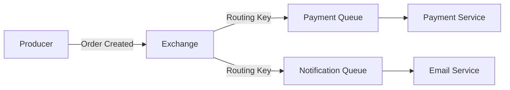

### **Сравнение RabbitMQ и Redis: когда выбрать RabbitMQ?**  

Оба инструмента (RabbitMQ и Redis) используются для обмена сообщениями, но у них разные архитектурные подходы и сценарии применения. **RabbitMQ** — это **брокер сообщений** (message broker), а **Redis** — это **in-memory хранилище данных** с поддержкой Pub/Sub и потоков.  

---

## **1. Основные преимущества RabbitMQ перед Redis**  

### **① Поддержка продвинутых паттернов обмена сообщениями**  
RabbitMQ изначально создан для работы с **очередями сообщений**, поэтому он поддерживает:  
- **Точечную доставку (Point-to-Point)**:  
  - Один отправитель (producer) → одна очередь → один получатель (consumer).  
- **Pub/Sub (издатель-подписчик)**:  
  - Одно сообщение → множество подписчиков через **Exchange + Binding**.  
- **Маршрутизацию сообщений**:  
  - Direct, Fanout, Topic, Headers Exchange для гибкой дистрибуции.  
- **Dead Letter Queues (DLQ)**:  
  - Автоматический перенос неудачных сообщений в отдельную очередь.  

**Redis** ограничен простым Pub/Sub и потоками (Streams), что не всегда удобно для сложных сценариев.  

---

### **② Надёжность и гарантии доставки**  
- **Подтверждение (ACK/NACK)**:  
  - RabbitMQ требует явного подтверждения (`ack`) от потребителя, иначе сообщение возвращается в очередь.  
  - В Redis Pub/Sub сообщения теряются при отключении подписчика.  
- **Сохраняемость (Persistence)**:  
  - RabbitMQ по умолчанию сохраняет сообщения на диск (если очередь durable).  
  - Redis хранит данные в памяти (требуется настройка RDB/AOF для сохранности).  
- **Транзакции**:  
  - RabbitMQ поддерживает подтверждение транзакций (`txSelect`, `txCommit`).  
  - В Redis транзакции (`MULTI/EXEC`) не гарантируют доставку в Pub/Sub.  

---

### **③ Управление нагрузкой и балансировка**  
- **Round-Robin**: RabbitMQ автоматически распределяет сообщения между потребителями.  
- **Prefetch Count**: Ограничение количества неподтверждённых сообщений у потребителя.  
- **Кластеризация**: RabbitMQ поддерживает **кластеры** с репликацией очередей.  

В Redis балансировка возможна только через **Redis Cluster** (для ключей) или ручное разделение каналов Pub/Sub.  

---

### **④ Мониторинг и администрирование**  
- **Веб-интерфейс**: RabbitMQ имеет встроенный UI для управления очередями, подключениями и мониторинга.  
- **Поддержка плагинов**:  
  - Например, `rabbitmq-prometheus` для экспорта метрик.  
- **Расширенные метрики**:  
  - Количество сообщений, скорость обработки, задержки.  

У Redis мониторинг ограничен командами `INFO` и сторонними инструментами.  

---

### **⑤ Поддержка протоколов и интеграций**  
RabbitMQ поддерживает:  
- **AMQP 0.9.1** (стандартный протокол для messaging).  
- **MQTT** (для IoT-устройств).  
- **STOMP** (для веб-сокетов).  
- **HTTP API** для управления.  

Redis использует только свой протокол (RESP), что ограничивает совместимость.  

---

## **2. Когда выбирать RabbitMQ?**  
### **Подходящие сценарии**  
✅ **Сложная маршрутизация сообщений** (например, логистика заказов с разными условиями).  
✅ **Гарантированная доставка** (финансовые транзакции, задачи с высокой важностью).  
✅ **Долгие задачи** (обработка видео, PDF), где нужно подтверждение выполнения.  
✅ **Интеграция с корпоративными системами** (ERP, CRM через AMQP).  

### **Пример архитектуры с RabbitMQ**  


---

## **3. Когда Redis лучше?**  
### **Подходящие сценарии**  
✅ **Кэширование** (быстрый доступ к данным).  
✅ **Счетчики и рейтинги** (инкремент/декремент).  
✅ **Простой Pub/Sub** (чат, уведомления в реальном времени).  
✅ **Стриминг данных** (через Redis Streams).  

### **Пример Pub/Sub в Redis**  
```python
# Подписчик
r = redis.Redis()
p = r.pubsub()
p.subscribe("orders")

# Издатель
r.publish("orders", "New order #123")
```

---

## **4. Сравнительная таблица**  
| Характеристика               | RabbitMQ                          | Redis (Pub/Sub/Streams)         |  
|------------------------------|-----------------------------------|----------------------------------|  
| **Тип**                      | Брокер сообщений                 | In-memory хранилище + Pub/Sub    |  
| **Гарантии доставки**        | ✅ (ACK, Persistence)            | ❌ (нет подтверждения)           |  
| **Паттерны маршрутизации**   | ✅ (Exchange, DLQ, Routing Key)  | ❌ (только каналы/группы)        |  
| **Скорость**                 | Средняя (из-за брокера)          | Максимальная (in-memory)         |  
| **Мониторинг**               | ✅ (Web UI, Prometheus)          | ❌ (только базовые команды)      |  
| **Использование памяти**     | Выше (сохраняет сообщения)       | Ниже (если не включен AOF/RDB)   |  

---

## **Вывод**  
**Выбирайте RabbitMQ, если:**  
- Нужны гарантии доставки и сложная маршрутизация.  
- Работаете с долгими фоновыми задачами (очереди > Pub/Sub).  
- Интегрируете корпоративные системы через AMQP/MQTT.  

**Выбирайте Redis, если:**  
- Нужна максимальная скорость и простой Pub/Sub.  
- Используете Redis как кэш или для стриминга.  

Для микросервисной архитектуры часто используют **оба инструмента**:  
- **Redis** — для кэша и событий в реальном времени.  
- **RabbitMQ** — для асинхронных задач с гарантиями.
