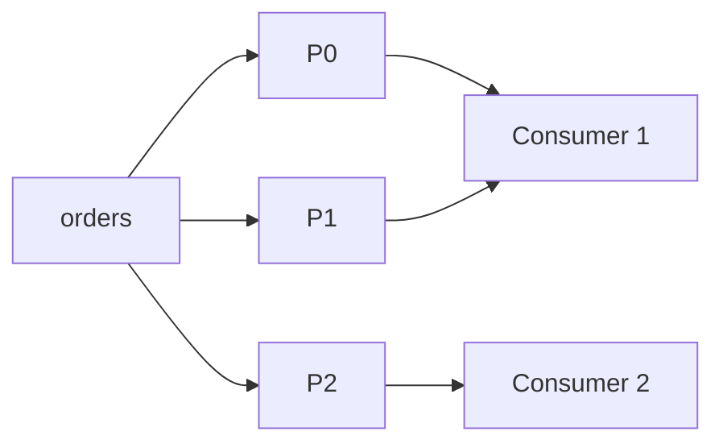
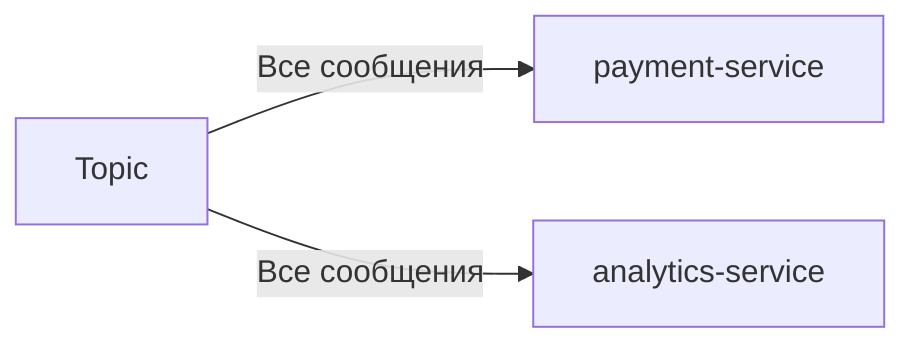

Да, в **Apache Kafka** у одной партиции может быть **только один консьюмер** в рамках одной consumer-группы. Однако есть нюансы и стратегии для параллельной обработки данных из партиции. Давайте разберём детально:

---

## **1. Основное правило: «Один консьюмер на партицию»**
- Каждая партиция в Kafka — это **упорядоченная последовательность сообщений**.  
- Чтобы сохранить порядок сообщений (ordering guarantee), Kafka позволяет **только одному консьюмеру** из consumer-группы читать одну партицию.  
- Если в группе несколько консьюмеров, они распределяются по разным партициям топика.

**Пример**:  
- Топик `orders` имеет **3 партиции** (P0, P1, P2).  
- Consumer-группа `payment-service` содержит **2 консьюмера** (C1, C2):  
  - C1 читает P0 и P1.  
  - C2 читает P2.  



---

## **2. Как обрабатывать одну партицию несколькими консьюмерами?**
### **Способ 1: Увеличить число партиций**
- Если нужно больше параллелизма, **создайте больше партиций** (например, 10 вместо 3).  
- Тогда можно запустить до 10 консьюмеров в одной группе.  

**Ограничение**:  
- Число партиций **нельзя изменить** после создания топика (без сложных хаков).  

---

### **Способ 2: Использовать несколько consumer-групп**
- Каждая группа получает **все сообщения** из топика независимо.  
- Пример:  
  - Группа `payment-service` обрабатывает платежи.  
  - Группа `analytics-service` строит отчёты.  



**Недостаток**:  
- Сообщения **дублируются** для каждой группы (увеличивается нагрузка).  

---

### **Способ 3: Параллельная обработка внутри консьюмера**
- Консьюмер читает сообщения из партиции и распределяет их на **worker-потоки** внутри своего процесса.  
- Пример на Python (с `concurrent.futures`):  

```python
from concurrent.futures import ThreadPoolExecutor

def process_message(msg):
    print(f"Processing: {msg.value}")

def consume():
    consumer = KafkaConsumer('orders', group_id='my-group')
    with ThreadPoolExecutor(max_workers=4) as executor:
        for msg in consumer:
            executor.submit(process_message, msg)
```

**Плюсы**:  
- Сохраняется порядок чтения из партиции.  
- Можно ускорить обработку CPU-bound задач.  

**Минусы**:  
- Усложняется управление состоянием (например, коммит офсетов).  

---

### **Способ 4: Kafka Streams / KSQL**
- Для сложной обработки (агрегации, join) используйте **Kafka Streams API**.  
- Позволяет параллельно обрабатывать поток данных, сохраняя порядок.  

Пример агрегации:  
```java
KStream<String, Order> stream = builder.stream("orders");
stream.groupByKey().count().to("order-counts");
```

---

## **3. Когда нельзя иметь несколько консьюмеров на партицию?**
- **Строгий порядок сообщений**: Например, цепочка событий `create → update → delete` должна обрабатываться последовательно.  
- **Транзакционные данные**: Чтобы избежать race condition (например, списание и зачисление денег).  

---

## **4. Исключение: «Shared Consumer» (редкий кейс)**
В некоторых фреймворках (например, **Spring Kafka**) есть костыли для «разделяемого» консьюмера:  
- Один физический консьюмер читает партицию.  
- Внутри он распределяет сообщения между worker-потоками.  

**Риски**:  
- Нарушается порядок обработки.  
- Сложно гарантировать exactly-once семантику.  

---

## **Вывод**
- **Стандартно**: 1 консьюмер = 1 партиция (для сохранения порядка).  
- **Если нужен параллелизм**:  
  - Увеличьте число партиций топика.  
  - Используйте несколько consumer-групп.  
  - Распределяйте работу внутри консьюмера (worker-потоки).  
- **Для сложной логики**: Kafka Streams.  

**Главное правило**:  
> Число консьюмеров в группе не должно превышать число партиций в топике. Иначе часть консьюмеров будет простаивать.  

Пример настройки в `consumer.properties`:  
```properties
group.id=my-group
partition.assignment.strategy=roundrobin
```