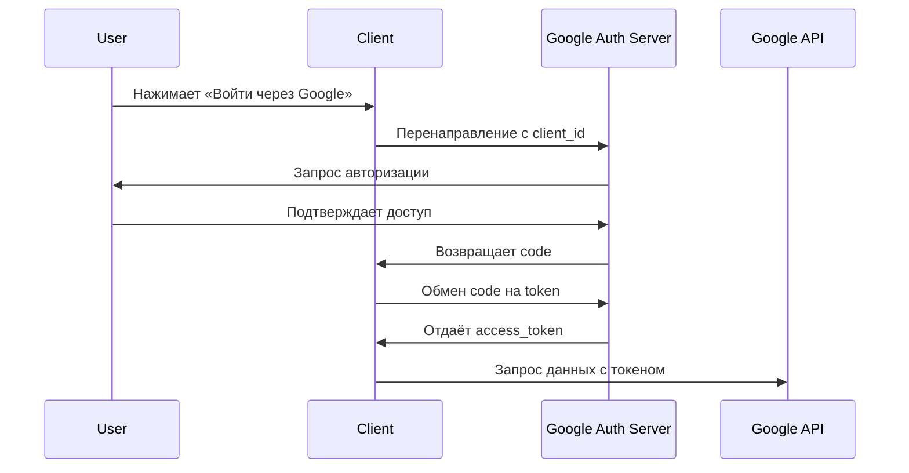

### **Что такое OAuth 2.0?**  
**OAuth 2.0** — это открытый стандарт авторизации, который позволяет приложениям получать **ограниченный доступ** к данным пользователя на других сервисах (например, Google, Facebook, GitHub) без раскрытия его пароля.  

---

## 🔹 **Для чего используется?**  
1. **Авторизация через соцсети**  
   - Кнопки «Войти через Google/Facebook».  
   - Пользователь не вводит логин/пароль — вместо этого доступ делегируется через OAuth.  

2. **API-доступ к данным**  
   - Например, мобильное приложение запрашивает доступ к Google Диску пользователя.  

3. **Микросервисная аутентификация**  
   - Сервисы общаются между собой, используя OAuth-токены.  

4. **Управление правами доступа**  
   - Пользователь может разрешить приложению только чтение почты (но не отправку писем).  

---

## 🔹 **Как это работает?**  
### Основные роли:  
- **User (Resource Owner)** — владелец данных.  
- **Client** — приложение, запрашивающее доступ.  
- **Authorization Server** (например, Google) — выдаёт токены.  
- **Resource Server** (например, Google Диск) — хранит данные пользователя.  

### 🔄 **Типовой поток (Authorization Code Flow)**  
1. **Приложение** перенаправляет пользователя на страницу авторизации (например, Google).  
2. **Пользователь** входит в аккаунт и разрешает доступ.  
3. **Сервер авторизации** возвращает `code` в приложение.  
4. **Приложение** обменивает `code` на **access token** (и, опционально, **refresh token**).  
5. **Access token** отправляется к API (например, для получения профиля пользователя).  



---

## 🔹 **Типы токенов**  
- **Access Token** — короткоживущий (часы/минуты), даёт доступ к данным.  
- **Refresh Token** — долгоживущий (дни/месяцы), обновляет access token.  

---

## 🔹 **Гранты (Grant Types)**  
- **Authorization Code** — для веб-серверов (наиболее безопасный).  
- **Implicit** — устарел (токен возвращается сразу, без `code`).  
- **Client Credentials** — для сервис-сервисного взаимодействия.  
- **Password** — устарел (передача логина/пароля приложению).  

---

## 🔹 **Примеры использования**  
1. **Вход через Google на сайте**  
   ```python
   # Пример для Flask
   from authlib.integrations.flask_client import OAuth
   oauth = OAuth(app)
   google = oauth.register('google', client_id='...', client_secret='...')
   ```

2. **Доступ к API GitHub**  
   ```bash
   curl -H "Authorization: Bearer ACCESS_TOKEN" https://api.github.com/user
   ```

---

## 🔹 **Безопасность**  
- **Всегда используйте HTTPS**.  
- **Не храните токены в фронтенде** (например, в JS).  
- **Проверяйте `state`-параметр** для защиты от CSRF.  

---

### **Итог**  
OAuth 2.0 — это стандарт для безопасной делегирования доступа.  
✅ **Плюсы**:  
- Пользователь не передаёт пароль приложению.  
- Гибкие настройки разрешений.  
- Поддержка всеми крупными платформами.  

❌ **Минусы**:  
- Сложность настройки.  
- Риски утечки токенов (если реализовано небрежно).  

**Где применяется?**  
🔹 Вход через соцсети, API-интеграции, микросервисы, IoT.