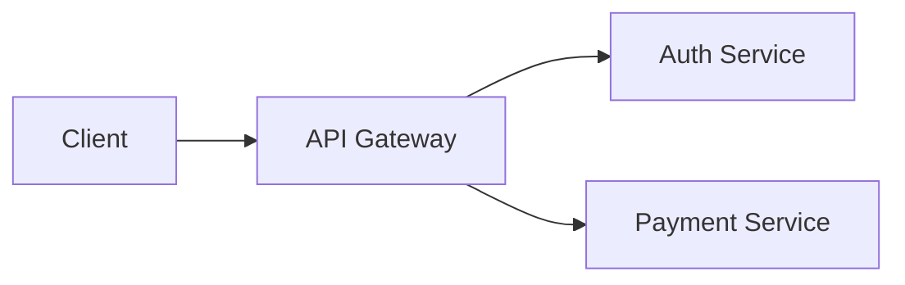

### **Цикл разработки ПО (Software Development Life Cycle, SDLC)**  
Это процесс создания, тестирования и поддержки программного обеспечения. Он включает **этапы от идеи до релиза и дальнейшего обновления**.  

---

## **1. Основные этапы SDLC**  

### **1.1. Сбор требований (Requirements Gathering)**  
**Что делают**:  
- Анализируют потребности бизнеса и пользователей.  
- Формируют **SRS** (Software Requirements Specification).  

**Результат**:  
- Документ с функциональными (что делает система) и нефункциональными (производительность, безопасность) требованиями.  

**Пример**:  
> *"Приложение должно авторизовывать пользователей по email и паролю (до 1000 RPS)".*  

---

### **1.2. Проектирование (Design)**  
**Что делают**:  
- Выбирают архитектуру (монолит, микросервисы).  
- Проектируют БД, API, интерфейсы.  
- Создают **UI/UX-макеты** (Figma, Adobe XD).  

**Результат**:  
- Техническое задание (ТЗ).  
- Схемы: ER-диаграммы, UML, пользовательские сценарии.  

**Пример архитектуры**:  


---

### **1.3. Разработка (Implementation)**  
**Что делают**:  
- Пишут код на выбранном стеке (Python/Java/JS и др.).  
- Проводят **code review**.  
- Настраивают CI/CD (например, GitHub Actions).  

**Результат**:  
- Рабочая версия продукта в dev-среде.  

**Пример CI/CD-пайплайна**:  
```yaml
# .github/workflows/deploy.yml
name: Deploy
on: push
jobs:
  test:
    runs-on: ubuntu-latest
    steps:
      - uses: actions/checkout@v4
      - run: pytest  # Запуск тестов
  deploy:
    needs: test
    run: kubectl apply -f k8s/
```

---

### **1.4. Тестирование (Testing)**  
**Что делают**:  
- **QA-инженеры** проверяют функционал, производительность, безопасность.  
- **Виды тестирования**:  
  - Юнит-тесты (разработчики).  
  - Интеграционные, системные, нагрузочные (QA).  

**Результат**:  
- Отчет о тестировании.  
- Исправленные баги.  

**Пример тест-кейса**:  
```markdown
TC-101: Проверка оплаты  
Шаги:  
1. Добавить товар в корзину.  
2. Перейти к оплате.  
Ожидаемо: Оплата проходит.  
```

---

### **1.5. Деплой (Deployment)**  
**Что делают**:  
- Разворачивают приложение на **прод-серверах**.  
- Используют стратегии:  
  - **Blue-Green** (переключение между двумя идентичными средами).  
  - **Canary** (постепенный rollout для части пользователей).  

**Результат**:  
- Рабочее приложение в продакшене.  

**Пример (Kubernetes)**:  
```bash
kubectl apply -f deployment.yaml  # Развертывание
kubectl rollout status deployment/app  # Мониторинг
```

---

### **1.6. Поддержка (Maintenance)**  
**Что делают**:  
- Мониторят логи (ELK, Grafana).  
- Исправляют баги.  
- Добавляют новый функционал.  

**Инструменты**:  
- **Sentry** — отслеживание ошибок.  
- **Prometheus** — метрики производительности.  

---

## **2. Модели SDLC**  
Выбор зависит от проекта:  

| Модель           | Плюсы                          | Минусы                         | Когда использовать?          |  
|------------------|-------------------------------|-------------------------------|------------------------------|  
| **Waterfall**    | Четкий план, документация.    | Нет гибкости, позднее тестирование. | Для простых проектов с ясными требованиями. |  
| **Agile/Scrum**  | Гибкость, частые релизы.      | Требует дисциплины команды.   | Стартапы, быстро меняющиеся продукты. |  
| **DevOps**       | Автоматизация, быстрый feedback. | Сложность настройки.          | Для микросервисов и облачных решений. |  

---

## **3. Роль тестировщика в SDLC**  
- **На этапе проектирования**: Участвует в оценке рисков.  
- **Во время разработки**: Пишет автотесты.  
- **Перед релизом**: Проводит регрессионное тестирование.  
- **После релиза**: Анализирует баги в продакшене.  

**Пример**:  
> *Тестировщик предлагает добавить проверку на SQL-инъекции в форму логина, пока разработчики еще пишут код.*  

---

## **4. Инструменты для каждого этапа**  
| Этап            | Инструменты                                                                 |  
|-----------------|-----------------------------------------------------------------------------|  
| **Требования**  | Confluence, Miro (для диаграмм).                                           |  
| **Проектирование** | Draw.io, Lucidchart (схемы архитектуры).                                |  
| **Разработка**  | Git (GitHub/GitLab), VS Code, IntelliJ IDEA.                               |  
| **Тестирование** | Selenium, Postman, JMeter.                                                |  
| **Деплой**      | Docker, Kubernetes, Ansible.                                               |  
| **Поддержка**   | Grafana, ELK Stack (логи), Sentry.                                         |  

---

## **5. Пример SDLC для веб-приложения**  
1. **Требования**: Клиенту нужен интернет-магазин с оплатой онлайн.  
2. **Проектирование**: Выбираем микросервисную архитектуру (API + отдельный сервис оплаты).  
3. **Разработка**:  
   - Фронтенд (React), бэкенд (Python/Django).  
   - Настройка CI/CD (тесты → сборка → деплой).  
4. **Тестирование**:  
   - Проверка оплаты (Sandbox Stripe).  
   - Нагрузочное тестирование корзины.  
5. **Деплой**: Разворачиваем в AWS (EKS).  
6. **Поддержка**: Мониторим ошибки, обновляем ассортимент.  

---

### **Итог**  
SDLC — это **карта** для создания ПО. Чем лучше организованы этапы, тем:  
- Меньше багов в продакшене.  
- Быстрее выпуск новых фич.  
- Ниже стоимость разработки.  

**Совет**: В Agile/DevOps этапы часто перекрываются — это нормально! Главное — **постоянная коммуникация** между разработчиками, тестировщиками и бизнесом.