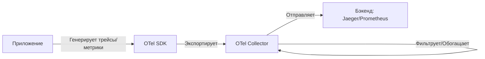

# **Полное руководство по OpenTelemetry: архитектура, компоненты и внедрение**

OpenTelemetry (OTel) — это **open-source проект** под эгидой CNCF (Cloud Native Computing Foundation), который предоставляет единый стандарт для сбора, обработки и экспорта телеметрии (метрик, трейсов и логов). Это эволюция OpenTracing и OpenCensus, объединившая их лучшие идеи.

---

## **1. Зачем нужен OpenTelemetry?**
### **Проблемы, которые решает OTel**
- **Разрозненность инструментов**: Раньше для мониторинга использовались разные SDK (Prometheus, Jaeger, Zipkin), что усложняло интеграцию.
- **Vendor lock-in**: Привязка к конкретному провайдеру (Datadog, New Relic) затрудняла миграцию.
- **Сложность масштабирования**: Ручная настройка агентов для сбора данных.

### **Преимущества OpenTelemetry**
- **Универсальность**: Единый API для всех типов телеметрии.
- **Кросс-платформенность**: Поддержка 10+ языков (Go, Java, Python, JS и др.).
- **Гибкость**: Можно отправлять данные в любую систему (Prometheus, Jaeger, Grafana, коммерческие SaaS).
- **Стандартизация**: Часть CNCF, как Kubernetes и Prometheus.

---

## **2. Основные концепции OpenTelemetry**
### **Типы телеметрии**
| Тип данных | Описание | Пример |
|------------|----------|--------|
| **Трейсы (Traces)** | Запись пути запроса через микросервисы | `HTTP GET /api → AuthService → PaymentService` |
| **Метрики (Metrics)** | Числовые показатели (CPU, latency, ошибки) | `requests_count{status="500"} = 42` |
| **Логи (Logs)** | Текстовые события (сообщения об ошибках) | `ERROR: DB connection timeout` |

### **Ключевые компоненты**
1. **API** — интерфейсы для генерации телеметрии.
2. **SDK** — реализация API для конкретного языка.
3. **Экспортеры** — отправка данных в бэкенд (Jaeger, Prometheus).
4. **Коллектор (Collector)** — центральный узел для обработки и маршрутизации данных.

---

## **3. Архитектура OpenTelemetry**


### **Детализация компонентов**
#### **① Инструментация (Instrumentation)**
- **Автоматическая**: Готовая интеграция для популярных фреймворков (Django, Spring, Express).
- **Ручная**: Кастомные трейсы через API:
  ```python
  from opentelemetry import trace
  tracer = trace.get_tracer("my_app")
  with tracer.start_as_current_span("payment_processing"):
      # Код обработки платежа
  ```

#### **② SDK (Language-Specific Implementation)**
- Регистрирует метрики, трейсы и логи.
- Управляет выборкой (sampling) — например, записывает только 10% трейсов для экономии ресурсов.

#### **③ Экспортеры (Exporters)**
| Тип экспортера | Назначение |
|----------------|------------|
| **OTLP (OpenTelemetry Protocol)** | Стандартный протокол для Collector |
| **Jaeger** | Для трейсов |
| **Prometheus** | Для метрик |
| **Console** | Вывод в терминал (для дебага) |

#### **④ Коллектор (Collector)**
- **Прием данных** от множества источников.
- **Обработка**: Фильтрация, обогащение метаданными.
- **Маршрутизация**: Отправка в нужный бэкенд.

Пример конфигурации Collector (`otel-collector-config.yaml`):
```yaml
receivers:
  otlp:
    protocols:
      grpc:
      http:

processors:
  batch: # Пакетная обработка
  memory_limiter: # Защита от перегрузки

exporters:
  logging: {}
  jaeger:
    endpoint: "jaeger:14250"
    tls:
      insecure: true

service:
  pipelines:
    traces:
      receivers: [otlp]
      processors: [batch]
      exporters: [jaeger]
```

---

## **4. Как внедрить OpenTelemetry?**
### **Шаг 1: Инструментация приложения**
**Для Python (пример):**
```bash
pip install opentelemetry-api opentelemetry-sdk opentelemetry-exporter-otlp
```

**Код:**
```python
from opentelemetry import trace
from opentelemetry.sdk.trace import TracerProvider
from opentelemetry.sdk.trace.export import BatchSpanProcessor
from opentelemetry.exporter.otlp.proto.grpc.trace_exporter import OTLPSpanExporter

# Настройка трейсов
trace.set_tracer_provider(TracerProvider())
tracer = trace.get_tracer(__name__)
otlp_exporter = OTLPSpanExporter(endpoint="http://collector:4317")
trace.get_tracer_provider().add_span_processor(BatchSpanProcessor(otlp_exporter))

# Пример трейса
with tracer.start_as_current_span("main_operation"):
    print("Hello, OpenTelemetry!")
```

### **Шаг 2: Запуск Collector**
```bash
docker run -p 4317:4317 -v ./otel-collector-config.yaml:/etc/otel-config.yaml otel/opentelemetry-collector --config=/etc/otel-config.yaml
```

### **Шаг 3: Настройка бэкенда**
- **Jaeger**: Для визуализации трейсов.
- **Prometheus + Grafana**: Для метрик.
- **Elasticsearch + Kibana**: Для логов.

---

## **5. Сценарии использования**
### **① Мониторинг микросервисов**
- Трейсы показывают полный путь запроса через сервисы.
- Метрики выявляют узкие места (например, высокий latency у AuthService).

### **② Отладка производственных инцидентов**
- Логи + трейсы помогают найти корневую причину сбоя.

### **③ Оптимизация затрат**
- Анализ метрик использования CPU/RAM для масштабирования.

---

## **6. Ограничения и подводные камни**
- **Производительность**: Включение трейсинга может добавить 5–10% нагрузки.
- **Сложность настройки**: Требуется тонкая настройка выборки (sampling).
- **Хранение данных**: Трейсы занимают много места (нужен эффективный бэкенд).

---

## **7. Интеграция с экосистемой**
| Инструмент | Для чего? |
|------------|----------|
| **Kubernetes** | Мониторинг подов через OTel-агент |
| **Istio/Linkerd** | Сбор трейсов сервис-меша |
| **AWS X-Ray** | Альтернатива для трейсов в облаке |

---

## **Вывод**
OpenTelemetry — это **будущее observability**, заменяющее разрозненные инструменты единым стандартом. Ключевые шаги для внедрения:
1. Инструментируйте приложение (авто- или ручная инструментация).
2. Настройте Collector для маршрутизации данных.
3. Подключите бэкенд (Jaeger, Prometheus).

Для старта используйте [официальную документацию](https://opentelemetry.io/docs/) и готовые примеры из репозитория [opentelemetry-helm](https://github.com/open-telemetry/opentelemetry-helm-charts).